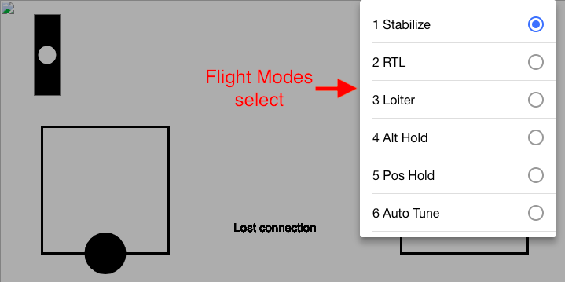

dude-DRONE is aimed for open sourcing a complete, upgradable drone system. In general, this repo consists of:
- Receiver-transmitter transmission based in Arduino
- Design of Quadcopter (parts of electronics), 3D Printed Phone holder for Remote Controller
- Phone Interface for Remote Controller

/eCalc.pdf shows the mechanical calculation of the drone (the one of which I own) <br />
<b>/preflight_check.mp4 shows working wireless connection from phone to the drone.</b>

<br />
<br />
<h3>Installation of hardware:</h3>
/fritzing is the schematic of the modules circuit. (transmitter side and receiver side) <br />
--- The output CPPM is on Digital 2 and this is connected to Arducopter. The GPS, compass, gyro, and accelerometer are natively provided by Arducopter. <br />
/controller_holder_CAD has all the STL files that can be 3d printed to construct the casing of controller that holds phone to have better handling.

<br />

<h3>Installation of mobile application:</h3>
I tested my application in Android because I have Android. However, this system can pratically be compiled in various mobile operating system (Android, iOS, Windows Phone). <br />

The app is in the directory phoneGUIv2. The Mobile Application is based in <b>Ionic v4</b>. It now supports basic control of the drone, remote API for camera recording, Flight Modes (from the APM). The window dimension of Huawei in which the App is specifically built is 720 x 360.

The general code to install the app in your phone. <i>(This instruction may vary depending on your platform)</i>
```
cd phoneGUIv2
ionic cordova build android
%The apk can now be built in respective Operating System
```

<h6>Transmitter and receiver code</h6>
/new_receiver is the Arduino code for receiver side <br />
/new_transmitter is the Arduino code for transmitter side

<h6>Camera code for Gimbal</h6>
/t3.py needs to be compiled to Raspberry Pi on the drone. For best usage, set it up per startup by configuring init.rc
<br />
<br />

<i>Figure 1 <br />

<br />
Figure 2 <br /></i>


<br />
<br />

<hr />
<b>Appendix</b>
<br />
phoneGUIv2 Workflow:
The ElementRef of canvas is created at the page Home, then all the canvas functions are in the canvasProvider so that anybody can use the canvas.

The canvas itself has to layers embedded. The back and the control, the back is the one that will not be refreshed. On the other hand, the control layer is the one that is going to be refreshed frequently and detect the coordinate of the mouse.

The x,y coordinate located at the center of the object, and size respectively.

page:
Home

provider:
canvas
